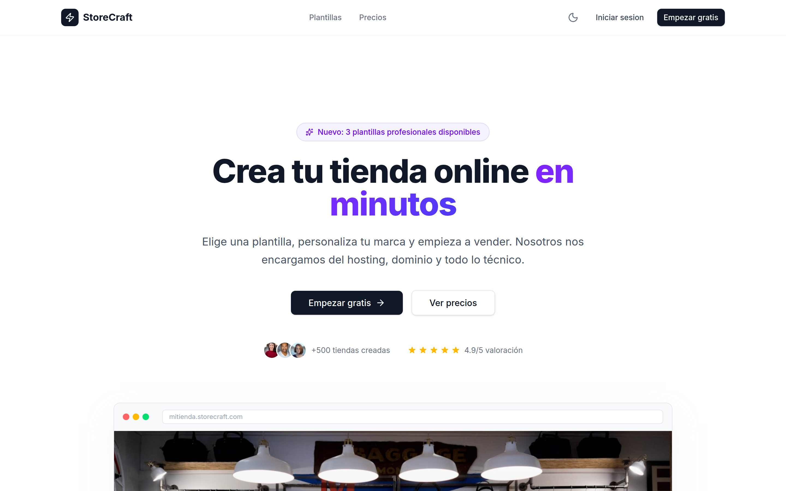
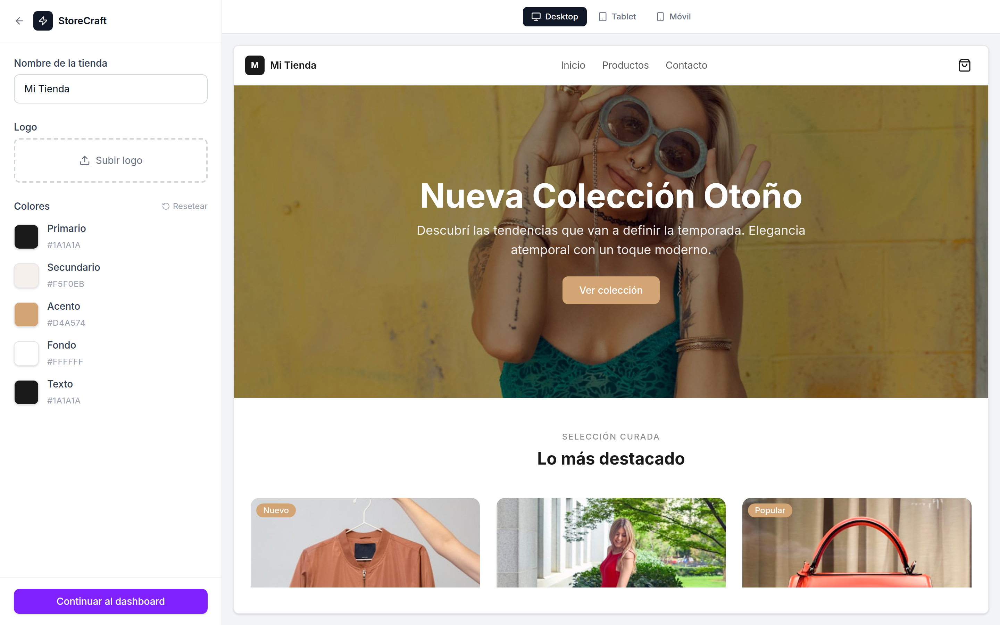

# StoreCraft

**Crea tu tienda online en minutos.** StoreCraft es una plataforma SaaS que permite a cualquier persona crear su propia tienda online eligiendo entre plantillas profesionales pre-diseñadas, personalizando colores, logo y nombre, y obteniendo una tienda lista para vender. Sin necesidad de conocimientos técnicos.

> **Estado actual:** MVP visual funcional. Frontend completo con datos mock. Backend y autenticación en desarrollo.

[](https://storecraft-mvp.netlify.app)

🔗 **Demo en vivo:** [storecraft-mvp.netlify.app](https://storecraft-mvp.netlify.app)

---

## Screenshots

### Landing Page


### Panel de Personalización


---

## Funcionalidades

- **3 plantillas profesionales** con estilos únicos para distintos nichos:
  - **Vogue** — Moda y ropa. Minimalista, elegante, tipografía limpia.
  - **ByteStore** — Electrónica y tech. Moderno, tema oscuro, acentos neón.
  - **FreshMarket** — Comida y orgánico. Cálido, verdes y naranjas.
- **Personalización en tiempo real** — Editor split-screen con color pickers, nombre de tienda, logo y preview en vivo actualizado con CSS custom properties.
- **Preview responsive** — Visualización de la tienda en modo Desktop, Tablet y Móvil.
- **Dashboard de administración** — Panel con estadísticas de ventas, gráficos, gestión de productos (CRUD completo) y seguimiento de pedidos.
- **Carrito de compras funcional** — Drawer lateral con gestión de cantidades y resumen de compra.
- **Dark mode** — Soporte completo de tema oscuro en toda la plataforma.
- **Diseño responsive** — Experiencia optimizada para todos los tamaños de pantalla.

---

## Tech Stack

| Tecnología | Uso |
|---|---|
| [React 19](https://react.dev) | UI framework |
| [Vite 7](https://vite.dev) | Build tool y dev server |
| [Tailwind CSS v4](https://tailwindcss.com) | Estilos utility-first |
| [React Router 7](https://reactrouter.com) | Navegación SPA |
| [Zustand 5](https://zustand.docs.pmnd.rs) | Estado global |
| [Lucide React](https://lucide.dev) | Iconografía |
| [Sonner](https://sonner.emilkowal.dev) | Notificaciones toast |

---

## Estructura del Proyecto

```
src/
├── components/
│   ├── ui/                  # Componentes reutilizables (Button, Card, Input, Badge, Modal...)
│   ├── layout/              # Layouts (Navbar, Footer, Sidebar, DashboardLayout)
│   ├── landing/             # Secciones del landing page
│   ├── template-selector/   # Selector y editor de plantillas
│   ├── dashboard/           # Componentes del panel de admin
│   └── store-templates/     # Plantillas de tienda (Vogue, ByteStore, FreshMarket)
├── pages/                   # Páginas de la aplicación
├── stores/                  # Zustand stores (customization, cart, dashboard)
├── data/                    # Datos mock (productos, pedidos, planes, testimonios)
├── hooks/                   # Custom hooks
└── utils/                   # Utilidades (cn, format)
```

---

## Instalación

```bash
# Clonar el repositorio
git clone https://github.com/execriss/storecraft-mvp.git
cd storecraft-mvp

# Instalar dependencias
npm install

# Iniciar servidor de desarrollo
npm run dev
```

La aplicación estará disponible en `http://localhost:5173`.

---

## Scripts

| Comando | Descripción |
|---|---|
| `npm run dev` | Servidor de desarrollo con HMR |
| `npm run build` | Build de producción |
| `npm run preview` | Preview del build local |
| `npm run lint` | Linting con ESLint |

---

## Rutas Principales

| Ruta | Descripción |
|---|---|
| `/` | Landing page del SaaS |
| `/templates` | Selección de plantillas |
| `/templates/:id/customize` | Editor de personalización en tiempo real |
| `/dashboard` | Panel de administración |
| `/dashboard/products` | Gestión de productos |
| `/dashboard/orders` | Seguimiento de pedidos |
| `/dashboard/settings` | Configuración de la tienda |
| `/preview/:id` | Vista previa de la tienda |

---

## Licencia

MIT
